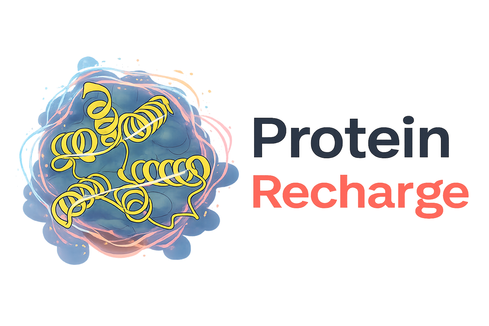
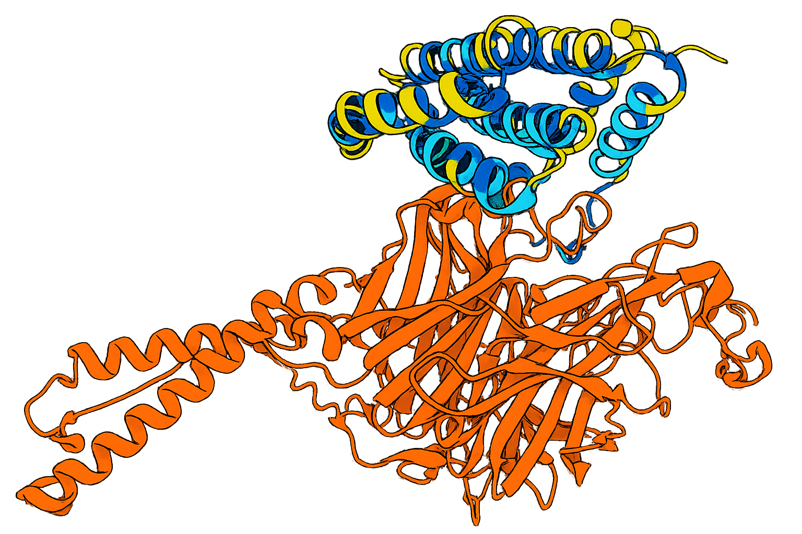

# ProteinRecharge

<p align="center">
  
</p>

ProteinRecharge is a small utility for recharging protein surfaces after binder design pipelines produce inappropriately charged binders, using LigandMPNN outputs.

## Quick start ✅

1. Clone this repository and install LigandMPNN:

```bash
git clone https://github.com/profdocpizza/ProteinRecharge.git
cd ProteinRecharge

```

2. Follow [LigandMPNN](https://github.com/dauparas/LigandMPNN/) instructions to install it and download weights 

3. Edit `examples/binder_recharge.yaml` and set the following fields for your environment:

```yaml
ligandmpnn_run_py: "/path/to/LigandMPNN/run.py"   # path to the LigandMPNN runner
ligandmpnn_conda_env: "ligandmpnn_env"          # or "" to use the current env
```

4. Check your configuration by running:

```bash
python check.py examples/binder_recharge.yaml
```
It will use biopython's SASA to identify burried residues. Also, it will account for user-specified residues as well as any residues in the interface with user-specified chains. To inspect the selections, open generated `.cif` file in Nano Viewer (VScode extention) and color by PLDDT: 

<table> <tr><th>Category</th><th>Description</th><th>Color</th></tr> <tr> <td><b>REDESIGNABLE</b></td> <td>Surface-exposed residues selected for redesign</td> <td><span style="color:#f6ed12;">■ Yellow</span></td> </tr> <tr> <td><b>PROTECTED</b></td> <td>Interface or user-protected residues (excluded from redesign)</td> <td><span style="color:#10cff1;">■ Cyan</span></td> </tr> <tr> <td><b>BURIED</b></td> <td>Non-exposed residues on the redesign chain</td> <td><span style="color:#106dff;">■ Blue</span></td> </tr> <tr> <td><b>NON_BINDER</b></td> <td>Residues on non-redesign chains</td> <td><span style="color:#ef821e;">■ Orange</span></td> </tr> </table>

<p align="center">
  
</p>

<table>
  <tr>
    <th>Category</th>
    <th>Description</th>
    <th>Color</th>
  </tr>

  <tr>
    <td><b>REDESIGNABLE</b></td>
    <td>Surface-exposed residues selected for redesign</td>
    <td>
      
    </td>
  </tr>

  <tr>
    <td><b>PROTECTED</b></td>
    <td>Interface or user-protected residues (excluded from redesign)</td>
    <td>
      
    </td>
  </tr>

  <tr>
    <td><b>BURIED</b></td>
    <td>Non-exposed residues on the redesign chain</td>
    <td>
      
    </td>
  </tr>

  <tr>
    <td><b>NON_BINDER</b></td>
    <td>Residues on non-redesign chains</td>
    <td></td>
  </tr>
</table>


4. Run the pipeline:

```bash
python recharge.py examples/binder_recharge.yaml
```

## Contributing 

PRs welcome — please include a short description and a reproducible example when opening issues.
